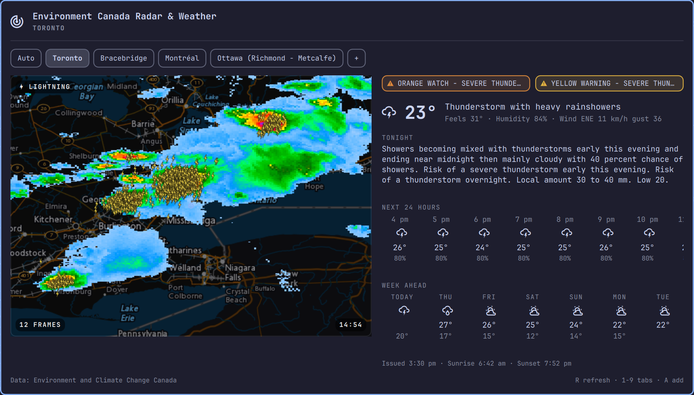
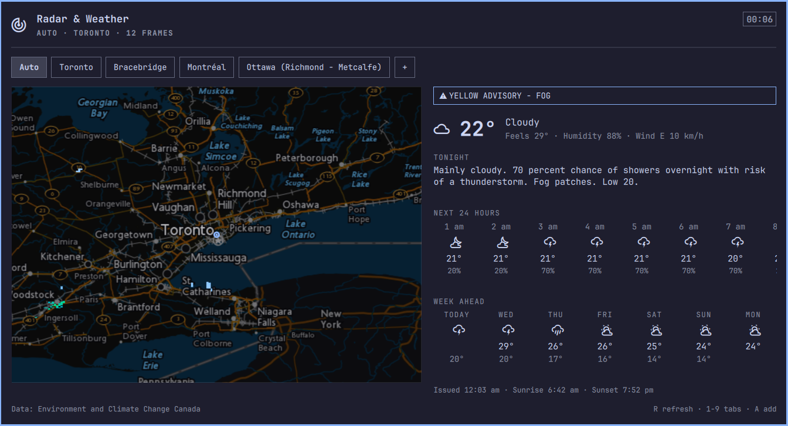

# EC Radar & Weather — Environment Canada widget for the Omarchy bar

An [Omarchy](https://omarchy.org/) shell bar widget for Environment and
Climate Change Canada's weather services. A 󰐷 pill sits in the status bar;
clicking it opens a panel with an animated precipitation-radar loop, with
lightning strikes overlaid, on the left and the full citypage weather feed
on the right — current conditions, the next forecast period in Environment
Canada's own words, a scrolling 24-hour strip, and the week ahead. Location tabs along the top: **Auto**
(geoip-detected) plus any cities you add from Environment Canada's official
site list.



The same panel on a light theme:



## Features

- **Location tabs** — a segmented control across the top of the panel.
  **Auto** locates you through [BeaconDB](https://beacondb.net/)'s geoip
  fallback (a coarse ~25 km fix — exactly the granularity a 280 km radar
  view needs, with no Geoclue/portal dependency) and snaps to the nearest
  Environment Canada site. Further tabs are cities you pick; **+** opens a
  searchable list of all ~855 citypage sites. If the fix lands more than
  200 km from any Environment Canada site (outside the country, or deep in
  the high Arctic), the Auto tab shows an out-of-coverage state instead of
  an empty map, with a button to add a Canadian city.
- **Weather pane** — everything the citypage feed knows about the active
  location: active **alerts** in a bordered banner, current conditions with
  feels-like/humidity/wind, the next period's full **text forecast**
  ("Mainly cloudy. 70 percent chance of showers…"), an hourly strip for the
  **next 24 hours** (scroll it sideways with the wheel or by dragging), and
  the **week ahead** — hover any day for its complete textual forecast.
- **Star to manage** — in the "+" search popup every row carries a star:
  starred cities are your tabs. Toggle the star (click, or `s` on the
  highlighted row) to add/remove without leaving the popup; activating a
  row body adds the city and switches straight to it. Right-clicking a
  city tab offers **Remove**; drag tabs to reorder.
- **Animated radar loop** — 12 frames at Environment Canada's native
  6-minute cadence (~72 minutes of history), with a hold on the newest
  frame before the loop rewinds, over NRCan's CBMT basemap with a marker at
  the active location.
- **Lightning overlay** — strikes from the last hour drawn as bolt glyphs on
  the radar map, one set per frame, so lightning moves with the rain. Bolt
  size shows how many strikes clustered at that spot.
- **Always warm** — radar frames and the forecast prefetch at shell startup
  and refresh in the background, so the panel opens instantly. Forecasts
  are cached per city, so switching tabs is instant and free.
- **Dark basemap** — on a dark desktop the bright CBMT paper map is run
  through an invert + 180° hue-rotate shader; follows the desktop's
  light/dark setting live (`darkMap` below).
- **Graceful degradation** — on fetch failure the last radar loop stays up
  with an "Offline" note and the last forecast is served from cache; the
  last good geoip fix is cached too, so Auto works offline.

## Interactions

| Input | Action |
|---|---|
| Left-click pill | Toggle panel |
| Middle-click pill / `R` | Refresh now (radar, forecast, geoip fix) |
| Click a tab | Switch location |
| `1`–`9` | Jump to tab (1 = Auto) |
| Right-click a city tab / `x` | Remove that city (via context menu) |
| Drag a city tab | Reorder your cities |
| `+` tab / `a` | Search & manage cities (star = keep as tab) |
| Hover a day in Week Ahead | Full textual forecast for that day |
| Wheel / drag on the hourly strip | Scroll through the 24 hours |
| Click map / Space / Enter | Play & pause the loop |
| `←` / `→` | Step frames (auto-pauses) |
| Esc | Close panel (or the open popup) |
| Tab / Shift-Tab | Switch to adjacent bar panels |

## Install

```bash
omarchy plugin add https://github.com/orospakr/omarchy-environment-canada-radar-weather.git --enable
```

The widget lands in the bar's center section by default (next to the
built-in weather pill). Move it with:

```bash
omarchy bar move ca.orospakr.ec-radar-weather --section center --after omarchy.weather
```

Manual alternative: clone the repository into
`~/.config/omarchy/plugins/ca.orospakr.ec-radar-weather` (the directory
name must match the plugin id) and run `omarchy plugin enable
ca.orospakr.ec-radar-weather`. The shell discovers plugins automatically.

## Remove

```bash
omarchy plugin remove ca.orospakr.ec-radar-weather
```

That deletes the plugin directory and its bar entry. The only other files
the plugin creates are a cached city list under
`~/.cache/omarchy/ca.orospakr.ec-radar-weather/`, which you can delete by
hand.

## Requirements and what it touches

- Omarchy with the Quattro shell (Quickshell). No extra packages: it uses
  `curl`, `bash`, and coreutils, which Omarchy ships.
- No root privileges, services, timers, or installers. Everything runs inside
  the shell process under your user.
- **Network**: Environment Canada (`geo.weather.gc.ca`, `dd.weather.gc.ca`,
  `weather.gc.ca`), Natural Resources Canada (`maps.geogratis.gc.ca`), and
  BeaconDB (`api.beacondb.net`, for the Auto tab's IP-based location fix).
  See [How it works](#how-it-works).
- **Writes**: its own entry in `~/.config/omarchy/shell.json` (your saved
  cities and the cached location fix, through the shell's normal settings
  path) and the cache directory above. Nothing else in your configuration
  is read or modified.
- **Hardening**: everything fetched is treated as untrusted — all
  remote-derived text is rendered as plain text (never rich text), the
  XML/CSV parsers bound input size, field lengths and list counts, every
  response is size-capped before it is parsed or cached, requests go only
  to the fixed HTTPS hosts listed above, and the `curl` calls refuse
  redirects, non-HTTPS protocols and oversized downloads.

### Upgrading from `andrew.radar` (≤ 1.2.0)

This plugin was renamed; the id on disk and in your bar layout must move
with it, and your saved cities live on the layout entry:

```bash
mv ~/.config/omarchy/plugins/andrew.radar ~/.config/omarchy/plugins/ca.orospakr.ec-radar-weather
sed -i 's/"andrew\.radar"/"ca.orospakr.ec-radar-weather"/' ~/.config/omarchy/shell.json
omarchy restart shell
```

## Configuration

Locations are managed from the panel itself and persisted by the shell onto
the widget's layout entry in `~/.config/omarchy/shell.json`:

```json
{
  "id": "ca.orospakr.ec-radar-weather",
  "locations": [
    { "siteCode": "s0000623", "name": "Ottawa (Kanata - Orléans)", "province": "ON",
      "latitude": 45.42, "longitude": -75.69 }
  ],
  "active": "auto",
  "autoFix": { "latitude": 45.03, "longitude": -79.32, "accuracy": 25000, "at": 1755820000000 }
}
```

- `locations` / `active` — the city tabs and the selected one (`"auto"` or
  a `siteCode`). Written by the panel; hand-editing works too and
  hot-reloads.
- `autoFix` — cached result of the last BeaconDB lookup (refreshed at most
  hourly), so the Auto tab renders immediately after a shell restart.

Entries from older versions that set `latitude` / `longitude` /
`locationName` directly are migrated automatically into a single saved
city on first load. (Such a migrated city has no citypage site code, so it
gets radar but no forecast — re-add it through **+** to fix that.)

The remaining tuning keys are optional; defaults shown:

```json
{
  "spanKm": 280,
  "frames": 12,
  "frameMs": 250,
  "holdMs": 1000,
  "pollMinutes": 30,
  "darkMap": "auto"
}
```

- `spanKm` — east–west width of the map in kilometres (applies to every
  tab).
- `frames` — loop length (6 minutes of history per frame, up to the 3-hour
  window GeoMet serves).
- `frameMs` / `holdMs` — animation speed and newest-frame hold.
- `pollMinutes` — background refresh cadence for radar and forecasts (the
  per-city forecast cache uses the same value as its TTL).
- `darkMap` — `auto` (follow the desktop), `on`, or `off`. Unknown values
  fall back to `auto`.

Dark mode is detected from Qt's `Application.styleHints.colorScheme`, which
the platform theme (gtk3) feeds from the same
`org.gnome.desktop.interface color-scheme` key omarchy sets when you switch
themes — so the map flips as soon as the theme does, without a restart. If
no platform theme answers, the widget falls back to the luminance of the
shell theme's background colour, using the same `R+G+B > 382` rule as
`omarchy-theme-color`.

### Lightning overlay

Strikes are drawn as lightning-bolt glyphs on the radar map, one set per
radar frame: each frame shows the strikes detected in the 6 minutes ending
at that frame's timestamp, so the loop shows lightning moving with the
rain. Bolt size encodes how many strikes were clustered at that spot,
matching the legend on weather.gc.ca:

- small — 1–5 strikes
- medium — 6–25
- large — 26–100
- largest — 101+

The feed only publishes the last hour, six minutes short of the default
12-frame loop. Ended bins never change, so the widget keeps them until they
fall off the loop: after the first background refresh the whole loop has
lightning, and only right after a shell start (or with a `frames` value
well past an hour) do the oldest frames show none — the top-left LIGHTNING
chip on the map disappears on those frames.

The data comes from the same feed the weather.gc.ca map itself uses
(Environment Canada's Canadian Lightning Detection Network, aggregated into
6-minute bins). That feed is not part of the documented MSC open-data
services, so it may change without notice; if it does, the overlay marks
itself unavailable and the radar loop is unaffected. Single strikes are
positioned to about a kilometre; clusters are drawn at their centroid. No
per-strike details (polarity, cloud-to-ground vs intra-cloud) are
published. The documented alternative, the GeoMet `Lightning_2.5km_Density`
WMS layer, is a 10-minute flash-density raster and is not used.

## How it works

Five services, no API keys:

- **Radar**: [MSC GeoMet](https://eccc-msc.github.io/open-data/msc-geomet/readme_en/)
  layer `RADAR_1KM_RRAI` (1 km rain-rate composite). The available time
  window is discovered from `GetCapabilities` — it is global to the layer,
  so switching tabs never re-asks — then one transparent PNG is fetched
  per 6-minute timestamp for the active bbox.
- **Lightning**: the weather.gc.ca map's own 6-minute strike feed (see
  [Lightning overlay](#lightning-overlay) above for its caveats), drawn as
  glyphs positioned in the same bbox as the radar frames.
- **Forecasts**: the [MSC Datamart citypage feed](https://dd.weather.gc.ca/today/citypage_weather/).
  Files land in per-UTC-hour directories (`{PROV}/{HH}/…_MSC_CitypageWeather_{site}_en.xml`)
  with no "latest" alias and no `/yesterday` root, so the widget probes
  today's hour listings newest-first and takes the newest file for the
  site. The XML is parsed by `Weather.js` — a small dependency-free
  library covering current conditions, the 12 day/night forecast periods,
  the 24 hourly entries, warnings, and sun times.
- **Basemap**: NRCan's
  [CBMT](https://www.nrcan.gc.ca/earth-sciences/geography/topographic-information/web-services/9110)
  WMS, requested with the same `EPSG:4326` bounding box so the layers
  stack exactly.
- **Auto location**: [BeaconDB](https://beacondb.net/)'s
  `/v1/geolocate` fallback (an MLS-compatible endpoint; an empty request
  body means "locate by IP"). City search uses the
  [citypage site list](https://dd.weather.gc.ca/today/citypage_weather/docs/)
  — a snapshot is bundled in `data/` for offline use and a copy in
  `~/.cache/omarchy/ca.orospakr.ec-radar-weather/` is refreshed monthly.

The dark basemap is a small `ShaderEffect` applied as the basemap `Image`'s
`layer.effect` (only when it is actually on — in light mode the layer is
disabled and the render path is unchanged). Qt needs shaders precompiled, so
`shaders/darkmap.frag.qsb` is committed alongside its GLSL source; rebuild it
with `shaders/build.sh` (needs `qt6-shadertools`) after editing the `.frag`.

The panel is a Quickshell/QML component following the Omarchy shell's
`bar-widget` plugin contract (`manifest.json` + `BarWidget.qml` +
`Panel.qml`, modelled on the built-in `omarchy.weather` plugin). All
fetches are asynchronous — QML's `XMLHttpRequest` for capabilities,
directory listings, and forecast XML, `curl` subprocesses for geoip and the
site list, and network-sourced `Image` elements (decoded off the main
thread) for frames — so the bar never blocks. Hourly times and sun times
are shown in this machine's local timezone.

Weather and radar data: [Environment and Climate Change Canada](https://weather.gc.ca/).
Basemap: Natural Resources Canada. IP geolocation: BeaconDB (DB-IP data,
CC BY 4.0). This project is not affiliated with any of them.

## License

[MIT](LICENSE). The bundled city list in `data/` is Environment Canada
data, used under the
[ECCC Data Servers End-use Licence](https://eccc-msc.github.io/open-data/licence/readme_en/).
